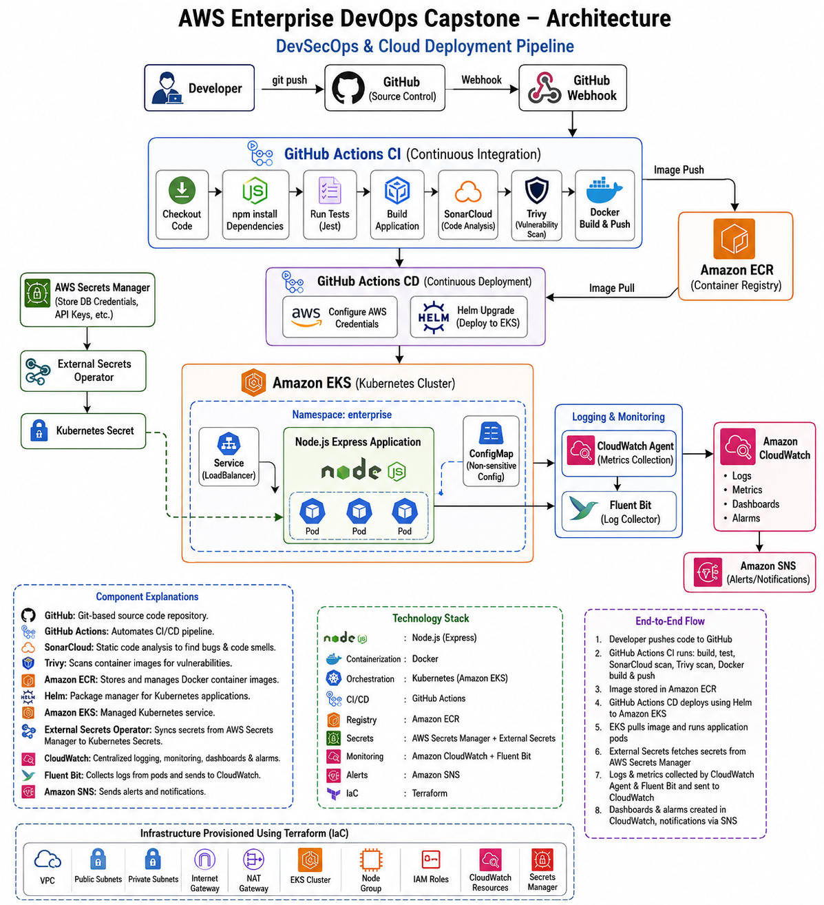

# AWS Enterprise DevSecOps Capstone Project

## Project Overview

This project demonstrates a complete Enterprise DevSecOps implementation on AWS using Infrastructure as Code, CI/CD, Kubernetes, Security, Monitoring, and Cost Optimization.

The application is a Node.js Express application deployed on Amazon EKS using Helm while following DevSecOps best practices.

---

# Project Architecture



---

# Technology Stack

| Category | Technology |
|-----------|------------|
| Cloud | AWS |
| Infrastructure | Terraform |
| Container | Docker |
| Registry | Amazon ECR |
| Orchestration | Amazon EKS |
| Package Manager | Helm |
| CI/CD | GitHub Actions |
| Source Control | GitHub |
| Security | SonarCloud, Trivy |
| Secrets | AWS Secrets Manager |
| Secret Sync | External Secrets Operator |
| Monitoring | Amazon CloudWatch |
| Logging | Fluent Bit |
| Alerts | Amazon SNS |
| Language | Node.js |
| Framework | Express |

---

# Architecture Flow

Developer

↓

GitHub Repository

↓

GitHub Actions CI

- Install dependencies
- Run Tests
- Build Application
- SonarCloud Scan
- Trivy Scan
- Build Docker Image

↓

Amazon ECR

↓

GitHub Actions CD

↓

Amazon EKS

↓

Helm Deployment

↓

Application Pods

↓

CloudWatch + Fluent Bit

↓

SNS Alerts

---

# Repository Structure

```
enterprise-devops-capstone/

├── app/
│   ├── server.js
│   ├── app.js
│   ├── package.json
│   └── tests/
│
├── terraform/
│   ├── modules/
│   ├── main.tf
│   ├── variables.tf
│   ├── outputs.tf
│   └── terraform.tfvars
│
├── kubernetes/
│   ├── deployment.yaml
│   ├── service.yaml
│   └── namespace.yaml
│
├── helm/
│   └── enterprise-app/
│
├── security/
│   ├── ecr-scan-report.md
│   ├── mitigation.md
│   ├── task14-rca.md
│   └── task15-network-troubleshooting.md
│
├── documentation/
│
├── screenshots/
│
└── .github/
    └── workflows/
        ├── ci.yml
        └── cd.yml
```

---

# Project Phases

## Phase 1

Infrastructure Provisioning

- Terraform Modules
- VPC
- Internet Gateway
- NAT Gateway
- Public Subnets
- Private Subnets
- IAM Roles
- Security Groups

---

## Phase 2

Amazon EKS

- EKS Cluster
- Managed Node Groups
- IAM OIDC
- kubectl Configuration

---

## Phase 3

Security

- AWS Secrets Manager
- External Secrets Operator
- IRSA
- Kubernetes Secrets

---

## Phase 4

Containerization

- Docker
- Amazon ECR
- Kubernetes Deployment
- Kubernetes Service
- Helm Charts

---

## Phase 5

Observability

- CloudWatch Agent
- Fluent Bit
- CloudWatch Dashboards
- CloudWatch Alarms
- SNS Notifications
- Log Insights

---

## Phase 6

DevSecOps

- SonarCloud
- Trivy
- npm audit
- ECR Vulnerability Scanning

---

## Phase 7

Troubleshooting

- Pipeline Debugging
- Kubernetes Networking Issue
- Root Cause Analysis

---

## Phase 8

Cost Optimization

- AWS Trusted Advisor
- Cost Explorer
- Resource Cleanup
- Cost Optimization Report

---

# CI/CD Pipeline

## Continuous Integration

- Checkout Code
- Install Packages
- Run Unit Tests
- Build Application
- SonarCloud Scan
- npm audit
- Trivy Filesystem Scan
- Docker Build
- Trivy Image Scan
- Upload Artifact

---

## Continuous Delivery

- Configure AWS Credentials
- Login to Amazon ECR
- Push Docker Image
- Helm Upgrade
- Deploy to Amazon EKS

---

# Security Features

- SonarCloud Static Analysis
- Trivy Filesystem Scan
- Trivy Image Scan
- npm audit
- AWS Secrets Manager
- External Secrets Operator
- IAM Roles for Service Accounts (IRSA)
- Amazon ECR Vulnerability Scan

---

# Monitoring

- Amazon CloudWatch
- Fluent Bit
- CloudWatch Dashboards
- CloudWatch Alarms
- Amazon SNS Notifications

---

# Commands

Terraform

```bash
terraform init
terraform validate
terraform plan
terraform apply
terraform destroy
```

Docker

```bash
docker build -t enterprise-devops-capstone .
docker run -p 3000:3000 enterprise-devops-capstone
```

Helm

```bash
helm install enterprise-app ./helm/enterprise-app

helm upgrade enterprise-app ./helm/enterprise-app
```

kubectl

```bash
kubectl get nodes

kubectl get pods -A

kubectl get svc -A
```

---

# Screenshots

Repository contains screenshots for:

- Terraform
- EKS
- GitHub Actions
- SonarCloud
- Trivy
- ECR
- CloudWatch
- Helm
- Kubernetes
- SNS
- Troubleshooting

---

# Learning Outcomes

- Infrastructure as Code
- Kubernetes Administration
- Helm Package Management
- GitHub Actions CI/CD
- DevSecOps Best Practices
- Security Automation
- Cloud Monitoring
- Cloud Logging
- Incident Troubleshooting
- Cost Optimization

---

# Author

**Ravi Teja**

AWS | Terraform | Kubernetes | Docker | GitHub Actions | DevSecOps